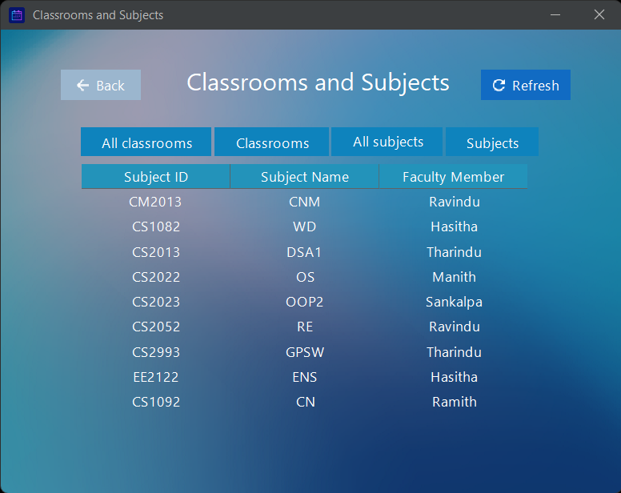

# timetable-management-system
> © Ramith Gunawardana, 2023. All Rights Reserved.

**GUI - Java SWING   Database - SQLite**

 This is a project done for an assignment in uni. 

## Features
1. 3 Modules - Schedules, Classrooms and Subjects, Resources
2. User Access Control - Admin, Faculty Member, Staff
3. Password encryption - SHA256
4. Save schedules and resources as PDFs
5. Backup database
6. Clean UI

## Screenshots

## Notice
This project is NOT open source. But you can [download](https://drive.google.com/drive/folders/1u2e6JDmyRrqqqXQX53Worn2os634OvOR?usp=sharing) and try.
  ^_^
